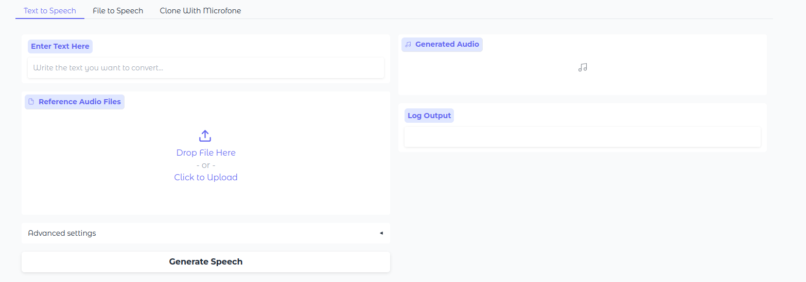

<div align="center">

# 🌌 Auralis Enhanced

### *Production-Ready Text-to-Speech with Voice Cloning & Network Deployment*

[](https://opensource.org/licenses/Apache-2.0)
[](https://www.python.org/downloads/)
[](https://github.com/groxaxo/Auralis-Enhanced)

*Process an entire novel in minutes, not hours. Convert the first Harry Potter book to speech in just 10 minutes!*

[Quick Start](#quick-start-) • [Deployment](#-server-deployment) • [Features](#key-features-) • [What's New](#-whats-new-in-this-fork) • [Credits](#-acknowledgments)

</div>

---

## 🚀 What is Auralis Enhanced?

**Auralis Enhanced** is a production-ready fork of the original Auralis TTS engine, optimized for network deployment and real-world server usage. This version includes comprehensive deployment documentation, network accessibility improvements, and GPU memory optimizations for running both backend API and frontend UI simultaneously.

### ⚡ Performance Highlights

- **Ultra-Fast Processing**: Convert the entire first Harry Potter book to speech in 10 minutes (**realtime factor of ≈ 0.02x!**)
- **Voice Cloning**: Clone any voice from short audio samples
- **Audio Enhancement**: Automatically enhance reference audio quality - works even with low-quality microphones
- **Memory Efficient**: Configurable memory footprint via `scheduler_max_concurrency`
- **Parallel Processing**: Handle multiple requests simultaneously
- **Streaming Support**: Process long texts piece by piece for real-time applications
- **Network Ready**: Pre-configured for `0.0.0.0` binding - accessible from any network interface
- **Production Deployment**: Complete guides for systemd, Docker, and Nginx

## 🆕 What's New in This Fork?

This enhanced version includes several improvements over the original Auralis:

### 🌐 Network Accessibility
- **Backend API Server**: Now defaults to `0.0.0.0:8000` (was `127.0.0.1:8000`)
- **Frontend Gradio UI**: Configured for `0.0.0.0:7863` for network access
- Both services accessible from any network interface out of the box

### 📚 Comprehensive Documentation
- **[Server Deployment Guide](docs/deployment/server-setup.md)**: Complete production deployment instructions
  - systemd service configuration
  - Docker & Docker Compose setup
  - Nginx reverse proxy examples
  - GPU memory management strategies
  - Security best practices

### ⚙️ Optimized Configuration
- **GPU Memory Optimization**: Frontend concurrency reduced to 4 (from 8) for better memory sharing
- **Concurrent Operation**: Backend and frontend can run simultaneously on same GPU
- **Language Auto-Detection**: All UI language dropdowns default to "auto"

### 🛠️ Production Ready
- Pre-configured for network deployment
- Optimized for multi-service GPU usage
- Complete monitoring and troubleshooting guides
- Security configuration examples

## Quick Start ⭐

### Installation from Source

1. **Clone this repository:**
   ```bash
   git clone https://github.com/groxaxo/Auralis-Enhanced.git
   cd Auralis-Enhanced
   ```

2. **Create a new Conda environment:**
   ```bash
   conda create -n auralis_env python=3.10 -y
   ```

3. **Activate the environment:**
   ```bash
   conda activate auralis_env
   ```

4. **Install dependencies:**
   ```bash
   pip install -r requirements.txt
   pip install -e .
   ```

### Basic Usage

Try it out via **Python**

```python
from auralis import TTS, TTSRequest

# Initialize
tts = TTS().from_pretrained("AstraMindAI/xttsv2", gpt_model='AstraMindAI/xtts2-gpt')

# Generate speech
request = TTSRequest(
    text="Hello Earth! This is Auralis speaking.",
    speaker_files=['reference.wav']
)

output = tts.generate_speech(request)
output.save('hello.wav')
```

or via **cli** using the OpenAI-compatible server (now defaults to `0.0.0.0` for network access):
```bash
# Backend API Server (accessible from network)
python -m auralis.entrypoints.oai_server --host 0.0.0.0 --port 8000

# Frontend Gradio UI (in another terminal)
cd examples
python gradio_example.py
```

The backend will be available at `http://your-server-ip:8000` and frontend at `http://your-server-ip:7863`.

For detailed deployment options (systemd, Docker, Nginx), see the **[Server Deployment Guide](docs/deployment/server-setup.md)**.

## Key Features 🛸

### Speed & Efficiency
- Processes long texts rapidly using smart batching
- Runs on consumer GPUs without memory issues
- Handles multiple requests in parallel

### Easy Integration
- Simple Python API
- Streaming support for long texts
- Built-in audio enhancement
- Automatic language detection

### Audio Quality
- Voice cloning from short samples
- Background noise reduction
- Speech clarity enhancement
- Volume normalization

## 🚀 Server Deployment

This fork is optimized for production server deployment with network accessibility.

### Quick Server Setup

After installing from source (see [Quick Start](#quick-start-)):

```bash
# 1. Navigate to the project directory
cd Auralis-Enhanced

# 2. Activate environment
conda activate auralis_env

# 3. Start Backend API (accessible from network)
python -m auralis.entrypoints.oai_server
# Runs on http://0.0.0.0:8000 by default

# 4. Start Frontend UI (in another terminal)
cd examples && python gradio_example.py
# Runs on http://0.0.0.0:7863 by default
```

### Production Deployment Options

We provide comprehensive guides for:

- **[systemd Services](docs/deployment/server-setup.md#using-systemd-services)**: Auto-start on boot, process management
- **[Docker Deployment](docs/deployment/server-setup.md#using-docker)**: Containerized deployment with GPU support
- **[Nginx Reverse Proxy](docs/deployment/server-setup.md#nginx-reverse-proxy)**: SSL termination, load balancing
- **[GPU Memory Management](docs/deployment/server-setup.md#gpu-memory-management)**: Optimize for concurrent services

### Configuration

**Backend Server Options:**
```bash
python -m auralis.entrypoints.oai_server \
  --host 0.0.0.0 \              # Network accessible (default)
  --port 8000 \                 # API port (default)
  --max_concurrency 8 \         # Concurrent requests (adjust for GPU)
  --model AstraMindAI/xttsv2 \
  --gpt_model AstraMindAI/xtts2-gpt
```

**Frontend Configuration:**
- Edit `examples/gradio_example.py` to adjust `scheduler_max_concurrency` (default: 4)
- Optimized for running alongside backend on same GPU

See **[Server Deployment Guide](docs/deployment/server-setup.md)** for complete documentation.

## XTTSv2 Finetunes

You can use your own XTTSv2 finetunes by converting them from the standard Coqui checkpoint format to safetensor format:

```bash
python src/auralis/models/xttsv2/utils/checkpoint_converter.py \
  path/to/checkpoint.pth \
  --output_dir path/to/output
```

This creates two folders: core XTTSv2 checkpoint and GPT2 component. Then initialize:

```python
tts = TTS().from_pretrained("path/to/core-xttsv2_model", 
                           gpt_model='path/to/xttsv2-gpt_model')
```

## Examples & Usage 🚀

### Basic Examples ⭐

<details>
<summary><b>Simple Text Generation</b></summary>

```python
from auralis import TTS, TTSRequest

# Initialize
tts = TTS().from_pretrained("AstraMindAI/xttsv2", gpt_model='AstraMindAI/xtts2-gpt')
# Basic generation
request = TTSRequest(
    text="Hello Earth! This is Auralis speaking.",
    speaker_files=["speaker.wav"]
)
output = tts.generate_speech(request)
output.save("hello.wav")
```
</details>

<details>
<summary><b>Working with TTSRequest</b> 🎤</summary>

```python
# Basic request
request = TTSRequest(
    text="Hello world!",
    speaker_files=["speaker.wav"]
)

# Enhanced audio processing
request = TTSRequest(
    text="Pristine audio quality",
    speaker_files=["speaker.wav"],
    audio_config=AudioPreprocessingConfig(
        normalize=True,
        trim_silence=True,
        enhance_speech=True,
        enhance_amount=1.5
    )
)

# Language-specific request
request = TTSRequest(
    text="Bonjour le monde!",
    speaker_files=["speaker.wav"],
    language="fr"
)

# Streaming configuration
request = TTSRequest(
    text="Very long text...",
    speaker_files=["speaker.wav"],
    stream=True,
)

# Generation parameters
request = TTSRequest(
    text="Creative variations",
    speaker_files=["speaker.wav"],
    temperature=0.8,
    top_p=0.9,
    top_k=50
)
```
</details>

<details>
<summary><b>Working with TTSOutput</b> 🎧</summary>

```python
# Load audio file
output = TTSOutput.from_file("input.wav")

# Format conversion
output.bit_depth = 32
output.channel = 2
tensor_audio = output.to_tensor()
audio_bytes = output.to_bytes()


# Audio processing
resampled = output.resample(target_sr=44100)
faster = output.change_speed(1.5)
num_samples, sample_rate, duration = output.get_info()

# Combine multiple outputs
combined = TTSOutput.combine_outputs([output1, output2, output3])

# Playback and saving
output.play()  # Play audio
output.preview()  # Smart playback (Jupyter/system)
output.save("processed.wav", sample_rate=44100)
```
</details>

### Synchronous Advanced Examples 🌟

<details>
<summary><b>Batch Text Processing</b></summary>

```python
# Process multiple texts with same voice
texts = ["First paragraph.", "Second paragraph.", "Third paragraph."]
requests = [
    TTSRequest(
        text=text,
        speaker_files=["speaker.wav"]
    ) for text in texts
]

# Sequential processing with progress
outputs = []
for i, req in enumerate(requests, 1):
    print(f"Processing text {i}/{len(requests)}")
    outputs.append(tts.generate_speech(req))

# Combine all outputs
combined = TTSOutput.combine_outputs(outputs)
combined.save("combined_output.wav")
```
</details>

<details>
<summary><b>Book Chapter Processing</b></summary>

```python
def process_book(chapter_file: str, speaker_file: str):
    # Read chapter
    with open(chapter_file, 'r') as f:
        chapter = f.read()
    
    # You can pass the whole book, auralis will take care of splitting
    
    request = TTSRequest(
            text=chapter,
            speaker_files=[speaker_file],
            audio_config=AudioPreprocessingConfig(
                enhance_speech=True,
                normalize=True
            )
        )
        
    output = tts.generate_speech(request)
    
    output.play()
    output.save("chapter_output.wav")
```
</details>

### Asynchronous Examples 🛸

<details>
<summary><b>Basic Async Generation</b></summary>

```python
import asyncio
from auralis import TTS, TTSRequest

async def generate_speech():
    tts = TTS().from_pretrained("AstraMindAI/xttsv2", gpt_model='AstraMindAI/xtts2-gpt')
    
    request = TTSRequest(
        text="Async generation example",
        speaker_files=["speaker.wav"]
    )
    
    output = await tts.generate_speech_async(request)
    output.save("async_output.wav")

asyncio.run(generate_speech())
```
</details>

<details>
<summary><b>Parallel Processing</b></summary>

```python
async def generate_parallel():
    tts = TTS().from_pretrained("AstraMindAI/xttsv2", gpt_model='AstraMindAI/xtts2-gpt')
    
    # Create multiple requests
    requests = [
        TTSRequest(
            text=f"This is voice {i}",
            speaker_files=[f"speaker_{i}.wav"]
        ) for i in range(3)
    ]
    
    # Process in parallel
    coroutines = [tts.generate_speech_async(req) for req in requests]
    outputs = await asyncio.gather(*coroutines, return_exceptions=True)
    
    # Handle results
    valid_outputs = [
        out for out in outputs 
        if not isinstance(out, Exception)
    ]
    
    combined = TTSOutput.combine_outputs(valid_outputs)
    combined.save("parallel_output.wav")

asyncio.run(generate_parallel())
```
</details>

<details>
<summary><b>Async Streaming with Multiple Requests</b></summary>

```python
async def stream_multiple_texts():
    tts = TTS().from_pretrained("AstraMindAI/xttsv2", gpt_model='AstraMindAI/xtts2-gpt')
    
    # Prepare streaming requests
    texts = [
        "First long text...",
        "Second long text...",
        "Third long text..."
    ]
    
    requests = [
        TTSRequest(
            text=text,
            speaker_files=["speaker.wav"],
            stream=True,
        ) for text in texts
    ]
    
    # Process streams in parallel
    coroutines = [tts.generate_speech_async(req) for req in requests]
    streams = await asyncio.gather(*coroutines)
    
    # Collect outputs
    output_container = {i: [] for i in range(len(requests))}
    
    async def process_stream(idx, stream):
        async for chunk in stream:
            output_container[idx].append(chunk)
            print(f"Processed chunk for text {idx+1}")
            
    # Process all streams
    await asyncio.gather(
        *(process_stream(i, stream) 
          for i, stream in enumerate(streams))
    )
    
    # Save results
    for idx, chunks in output_container.items():
        TTSOutput.combine_outputs(chunks).save(
            f"text_{idx}_output.wav"
        )

asyncio.run(stream_multiple_texts())
```
</details>


## Core Classes 🌟

<details>
<summary><b>TTSRequest</b> - Unified request container with audio enhancement 🎤</summary>

```python
@dataclass
class TTSRequest:
    """Container for TTS inference request data"""
    # Request metadata
    text: Union[AsyncGenerator[str, None], str, List[str]]

    speaker_files: Union[List[str], bytes]  # Path to the speaker audio file

    enhance_speech: bool = True
    audio_config: AudioPreprocessingConfig = field(default_factory=AudioPreprocessingConfig)
    language: SupportedLanguages = "auto"
    request_id: str = field(default_factory=lambda: uuid.uuid4().hex)
    load_sample_rate: int = 22050
    sound_norm_refs: bool = False

    # Voice conditioning parameters
    max_ref_length: int = 60
    gpt_cond_len: int = 30
    gpt_cond_chunk_len: int = 4

    # Generation parameters
    stream: bool = False
    temperature: float = 0.75
    top_p: float = 0.85
    top_k: int = 50
    repetition_penalty: float = 5.0
    length_penalty: float = 1.0
    do_sample: bool = True
```

### Examples

```python
# Basic usage
request = TTSRequest(
    text="Hello world!",
    speaker_files=["reference.wav"]
)

# With custom audio enhancement
request = TTSRequest(
    text="Hello world!",
    speaker_files=["reference.wav"],
    audio_config=AudioPreprocessingConfig(
        normalize=True,
        trim_silence=True,
        enhance_speech=True,
        enhance_amount=1.5
    )
)

# Streaming long text
request = TTSRequest(
    text="Very long text...",
    speaker_files=["reference.wav"],
    stream=True,
)
```

### Features
- Automatic language detection
- Audio preprocessing & enhancement
- Flexible input handling (strings, lists, generators)
- Configurable generation parameters
- Caching for efficient processing

</details>

<details>
<summary><b>TTSOutput</b> - Unified output container for audio processing 🎧</summary>

```python
@dataclass
class TTSOutput:
    array: np.ndarray
    sample_rate: int
```

### Methods

#### Format Conversion
```python
output.to_tensor()      # → torch.Tensor
output.to_bytes()       # → bytes (wav/raw)
output.from_tensor()    # → TTSOutput
output.from_file()      # → TTSOutput
```

#### Audio Processing
```python
output.combine_outputs()  # Combine multiple outputs
output.resample()        # Change sample rate
output.get_info()        # Get audio properties
output.change_speed()    # Modify playback speed
```

#### File & Playback
```python
output.save()           # Save to file
output.play()          # Play audio
output.display()       # Show in Jupyter
output.preview()       # Smart playback
```

### Examples

```python
# Load and process
output = TTSOutput.from_file("input.wav")
output = output.resample(target_sr=44100)
output.save("output.wav")

# Combine multiple outputs
combined = TTSOutput.combine_outputs([output1, output2, output3])

# Change playback speed
faster = output.change_speed(1.5)
```

</details>


## Languages 🌍

XTTSv2 Supports: English, Spanish, French, German, Italian, Portuguese, Polish, Turkish, Russian, Dutch, Czech, Arabic, Chinese (Simplified), Hungarian, Korean, Japanese, Hindi

## Performance Details 📊

Processing speeds on NVIDIA 3090:
- Short phrases (< 100 chars): ~1 second
- Medium texts (< 1000 chars): ~5-10 seconds
- Full books (~500K chars @ concurrency 36): ~10 minutes

Memory usage:
- Base: ~2.5GB VRAM concurrency = 1
- ~ 5.3GB VRAM concurrency = 20


## Gradio

[Gradio code](https://github.com/astramind-ai/Auralis/blob/main/examples/gradio_example.py)




## 🤝 Contributing

We welcome contributions to improve Auralis Enhanced!

### For This Fork
- Open issues for bugs, feature requests, or deployment questions
- Submit pull requests for improvements
- Share your deployment experiences and configurations

### For the Original Auralis
- Visit the [original Auralis repository](https://github.com/astramind-ai/Auralis)
- Follow their [Contribution Guidelines](https://github.com/astramind-ai/Auralis/blob/main/CONTRIBUTING.md)
- Join the [Discord community](https://discord.gg/BEMVTmcPEs)


## 📖 Learn More

### This Fork (Enhanced)
- **[Server Deployment Guide](docs/deployment/server-setup.md)**: Complete production deployment documentation

### Original Auralis Project
- **[Technical Deep Dive](https://www.astramind.ai/post/auralis)**: Original AstraMind AI blog post
- **[Original Repository](https://github.com/astramind-ai/Auralis)**: Upstream Auralis project
- **[Adding Custom Models](https://github.com/astramind-ai/Auralis/blob/main/docs/advanced/adding-models.md)**: Model customization guide

## 🙏 Acknowledgments

This project stands on the shoulders of giants. We extend our deepest gratitude to:

### 🌟 Original Auralis Project
- **[AstraMind AI Team](https://github.com/astramind-ai)** - For creating and maintaining the original Auralis TTS engine
  - The brilliant architecture and implementation that made this all possible
  - Continuous innovation in making TTS practical for real-world use
- **Original [Auralis Repository](https://github.com/astramind-ai/Auralis)** - The upstream project this fork is based on
- All [contributors](https://github.com/astramind-ai/Auralis/graphs/contributors) to the original Auralis project

### 🤖 Core Technology Partners
- **[Coqui AI](https://coqui.ai/)** - For the exceptional **XTTSv2 model** that powers voice synthesis
  - The XTTSv2 architecture and pretrained models
  - Pioneering work in voice cloning and multilingual TTS
  - Components under `auralis/models/xttsv2/components/tts` are licensed under [Coqui AI License](https://coqui.ai/cpml)
  
- **[OpenAI](https://openai.com/)** - For **Whisper** and advancing the field of speech AI
  - Revolutionary speech recognition technology
  - Pushing the boundaries of what's possible with audio AI
  
- **[vLLM Team](https://github.com/vllm-project/vllm)** - For the high-performance **vLLM inference engine**
  - Enabling fast, efficient model serving
  - Making large-scale inference practical
  
- **[Hugging Face](https://huggingface.co/)** - For model hosting and the transformers ecosystem
  - Democratizing access to AI models
  - Providing the infrastructure for model distribution

### 🔧 Infrastructure & Tools
- **[Gradio](https://gradio.app/)** - For the excellent web UI framework
- **[FastAPI](https://fastapi.tiangolo.com/)** - For the modern, fast API framework
- **[PyTorch](https://pytorch.org/)** - For the deep learning foundation

### 🌍 Community & Support
- The **open-source community** for continuous inspiration and support
- **Discord community members** for valuable feedback and testing
- Everyone who has starred, forked, or contributed to Auralis
- All researchers and developers advancing the field of speech synthesis

### 📝 This Enhanced Fork
- **Enhanced by**: [groxaxo](https://github.com/groxaxo)
- **Focus**: Production deployment, network accessibility, and comprehensive documentation
- **Contributions**: Server deployment guides, GPU optimization, network configuration

---

## 📄 License

**Codebase**: Released under [Apache 2.0 License](LICENSE) - feel free to use it in your projects!

**XTTSv2 Model**: The XTTSv2 model and files under `auralis/models/xttsv2/components/tts` are licensed under the [Coqui AI License](https://coqui.ai/cpml).

---

<div align="center">

### 🌟 Original Auralis by [AstraMind AI](https://github.com/astramind-ai)
### 🚀 Enhanced for Production by [groxaxo](https://github.com/groxaxo)

**Original Project**: [astramind-ai/Auralis](https://github.com/astramind-ai/Auralis) • **This Fork**: [groxaxo/Auralis-Enhanced](https://github.com/groxaxo/Auralis-Enhanced)

**[AstraMind Website](https://www.astramind.ai)** • **[Discord Community](https://discord.gg/BEMVTmcPEs)**

---

*If you find this project useful, please consider:*
- ⭐ **Starring** both the [original repository](https://github.com/astramind-ai/Auralis) and [this fork](https://github.com/groxaxo/Auralis-Enhanced)
- 🔄 **Sharing** with others who might benefit
- 🤝 **Contributing** improvements and deployment experiences

**Built with ❤️ by the open-source community**

</div>
